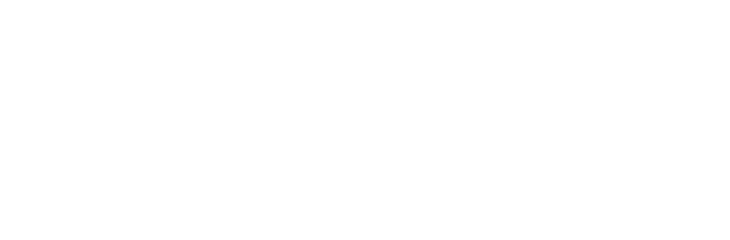

Welcome to SaferRL!
==================================

**SaferRL** is a Python library that makes it easier to learn about safe reinforcement learning.

.. note::

   This project is under active development.

.. toctree::
   :maxdepth: 2
   :caption: User Documentation

   user/introduction
   user/installation
   user/algorithms
   user/running
   user/saving_and_loading
   user/plotting

.. toctree::
   :maxdepth: 2
   :caption: Introduction to Safe RL

   saferrl/saferl_intro
   

.. toctree::
   :maxdepth: 2
   :caption: Resources

   saferrl/keypapers
   saferrl/bench

.. toctree::
   :maxdepth: 2
   :caption: Algorithms Docs

   algorithms/cpo

.. toctree::
   :maxdepth: 2
   :caption: Etc.

   etc/acknowledgements
   etc/author

Indices and tables
==================

* :ref:`genindex`
* :ref:`modindex`
* :ref:`search`
